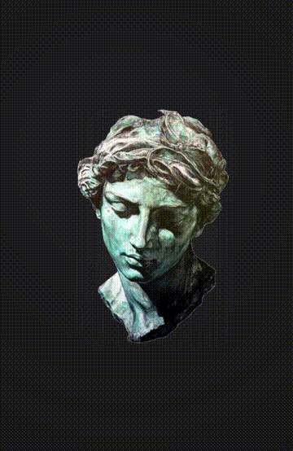

# Pixel Melt

A browser-based interactive pixel-sorting / melt / collapse effect tool. Drop any image and watch it dissolve into flowing pixel columns with real-time parameter control.

Built with vanilla JavaScript and Canvas 2D API. Single HTML file for easy distribution.

## Demo

<p align="center">
  
  &nbsp;&nbsp;
  
</p>

<p align="center">
  <a href="assets/demo-1.mp4">Full Video 1</a> · <a href="assets/demo-2.mp4">Full Video 2</a>
</p>

## Features

### Melt Engine
- **Per-pixel displacement** with forward-mapping and interpolated gap-filling (zero tearing)
- **Direction control** — Down / Up / Mixed (per-column random)
- **Bounce mode** — pixels oscillate back and forth with adjustable range
- **Layered melt** — dissolves by luminance bands (bright areas first, dark areas last)
- **Strip width** — probability-biased column grouping (fine pixel rain to coarse block collapse)

### Color & Image
- **6 color presets** — Ethereal, Arctic, Ember, Neon, Sunset, Void
- **Tint strength** control
- **Saturation** and **Contrast** adjustment
- Pixel-level soft-light blending that only affects image pixels (transparent areas stay clean)

### Background
- Solid color / Gradient / Black & White modes
- Full color picker control

### Interaction
- **Scroll to zoom** (pivots around mouse cursor)
- **Drag to pan**
- **Drop any image** to load (or click to browse)
- **AI background removal** — powered by [@imgly/background-removal](https://github.com/imgly/background-removal-js) (model downloaded on first use, cached after)

### Controls
| Control | Range | Description |
|---|---|---|
| Melt Speed | 0.1x - 5.0x | Animation speed multiplier |
| Direction | Down / Up / Mixed | Pixel displacement direction |
| Bounce | On/Off + Range | Oscillating displacement |
| Layered Melt | On/Off + Band Gap | Luminance-based dissolution order |
| Origin | 0% - 95% | Where melt boundary starts (top to bottom) |
| Spread | 0% - 100% | Random variation of melt boundary |
| Strip Width | 0% - 100% | Column grouping width bias |
| Color Tone | 6 presets | Gradient color overlay |
| Tint Strength | 0% - 100% | Color overlay intensity |
| Saturation | 0% - 250% | Image saturation |
| Contrast | 0% - 250% | Image contrast |
| Remove BG | On/Off | AI-powered background removal |
| Background | Solid / Gradient / B&W | Canvas background mode |

## Usage

Open `dist/pixel-melt.html` in a browser — no build step or server required.

For development, the source is modularized under `src/`:
```bash
npx serve src          # dev server
npm run build          # bundle → dist/pixel-melt.html
```

Drop an image (PNG with transparency works best) and adjust the controls in the left panel.

## Technical Details

- **Rendering**: Per-pixel ImageData manipulation with pre-allocated buffer and dirty-region tracking
- **Color overlay**: Pixel-level blending (normal + soft-light formula) instead of canvas composite modes, guaranteeing zero bleed onto transparent areas
- **Buffer architecture**: Y-offset buffer with headroom above and below for bidirectional displacement
- **Performance**: Reusable Uint32Array buffer, dirty-region-scoped tint/saturation/contrast loops, partial putImageData

## Acknowledgments

- AI background removal powered by [@imgly/background-removal](https://github.com/imgly/background-removal-js) (AGPL-3.0), loaded via CDN at runtime

## License

MIT — note that the `@imgly/background-removal` dependency is licensed under AGPL-3.0
